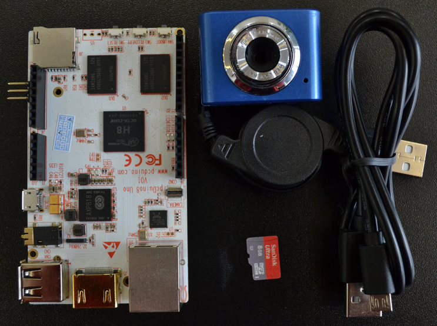

# Introduction of OpenCV computer vision kit

pcDuino is pin to pin compatible with Arduino so that existing Arduino shields can be installed on pcDuino with a simple translation board (T-board). By being compatible with Arduino ecosystem, pcDuino is a platform that bridges the power of open software linux and the power of open hardware.

Recently, LinkSprite released a powerful mini PC platform pcDuino8 Uno which is powered by Allwinner H8 SoC chip. It has 8 Cortex-A7 ARM cores whose operating frequency is up to 2.0GHz.

Base on this powerful platform, we have constructed a new kit called OpenCV computer vision kit which users can use to quick start OpenCV computer vision and do lost of fun stuff including but not limited to the follows:
* Learn or teach programming
* Learn Ubuntu Linux
* Work with hardware part
* OpenCV computer vision
* Implement a network video monitoring system
* DIY a simple camera
* Motion detection
* Face detection



## Specifications

### 1. Hardware
* pcDuino8 Uno x 1
* USB WebCam x 1
* USB micro data line x 1
* 8G TF card x 1

### 2. Software

We has created a [Ubuntu14.04 image file for OpenCV computer vision kit](https://s3.amazonaws.com/pcduino/Images/pcduino8/pcDuino8Uno/pcduino8_ubuntu14.04_20151121_preinstalled_opencv2.4.11.7z), which has pre-installed the following things:
* git
* vim
* Python 2.7
* OpenCV 2.4.11
* motion
* guvcview
* ffmpeg
* demo source code(at home directory)

## More information
If you want to get more documents and demos' source code for pcDuino8 Uno, please check the following websites.

### 1. [OpenCV Computer Vision Kit Guide](https://github.com/pcduino/pcduino8-uno-guide)
This is the github repository collecting documents and demos about OpenCV computer vision kit and let user quick start on OpenCV computer vision.
Use git to download:
```
$ git clone https://github.com/pcduino/pcduino8-uno-guide
```
### 2. [Image for pcDuino8 Uno](http://www.linksprite.com/image-for-pcduino8-uno/)
This website has collected different system image for pcDuino8 Uno, including Ubuntu and Android.

### 3. [Learning Center](http://learn.linksprite.com/)
This website has been collected many posts on pcDuinos, not only pcDuino8 Uno.

### 4. [Forum](http://forum.linksprite.com/)
If you have any question, please post it there, LinkSprite Engineers will try their best to answer your questions.

