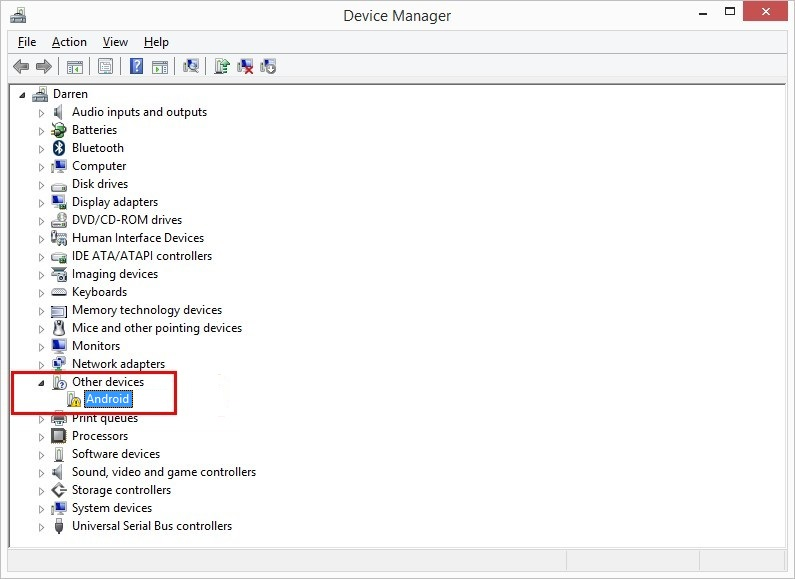
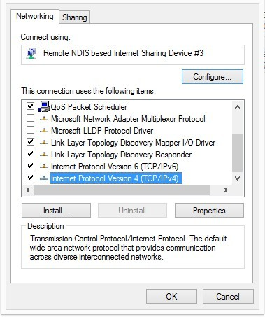
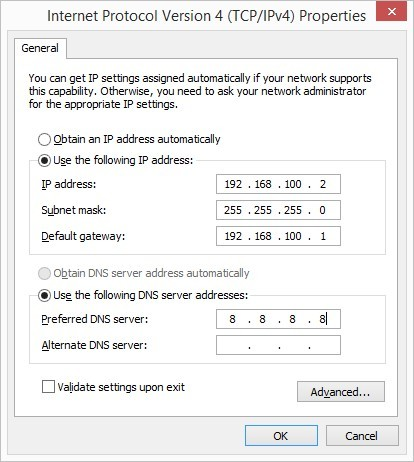

# VNC to pcDuino8 Uno through USB-OTG in Win8 system
This tutorial will tell you how to quick access Ubuntu running on pcDuino8 Uno , just using an USB data line,without keyboard, mouse, and HDMI screen.

## Prepare
- pcDuino8 Uno
- USB micro USB line
- Windows PC(XP/Win7/Win8)
- Windows tool: [vncviewer](https://www.realvnc.com/download/viewer/)

## Install Driver(Take Win7 for example)

1. First connect pcDuino8 Uno to the computer's USB port through USB OTG.

2. Open **Device Manager** in Windows.
3. Right click **Android ** under **other devices** and choose **Update Driver Software**.

4. Choose the **browse my computer for driver software**.
5. Under **Common hardware types**, choose **Network adapters**.
6. Under Manufacturer choose **Microsoft Corporation **, and Network Adapter choose **Remote NDIS based Compatible Device**.
7. Windows will prompt the warning information, click Yes, after a while it will prompt that the Windows has successfully updated your driver software.

## Set the Static Address
1. Right click the option( or win +x), choose **Network Connections**.
2. Right click the **Remote NDIS based Compatible Device**, choose properties.
3. Double click Internet Protocol version 4 (TCP/IPv4).

4. General set options as follow:

## Use VNC to connect to pcDuino:

1. Open the VNC Viewer, input the: 192.168.100.1 (which is the IP address of the pcDuino8 Uno) in the server:

2. pcDuino desktop will successfully show at the VNC from OTG.

