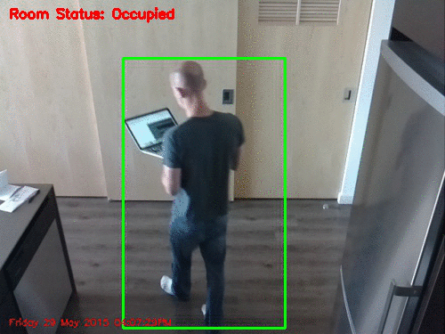
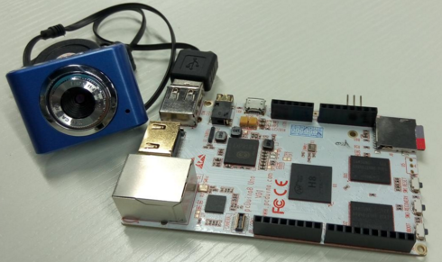

# Motion detection

## Introduction
[Adrian Rosebrock][1] posted a blog , named " [Home surveillance and motion detection with the Raspberry Pi, Python, OpenCV, and Dropbox][2]". This project is very cool, it can take a picture if there are things moving , then upload to Dropbox.



I can't help thinking about how to port this project onto pcDuino8 Uno. Yes, this is not very hard!

## Pre-requisites:
* Hardware
  - OpenCV computer vision kit



* Software
  - Ubuntu 14.04
  - Python 2.7.6
  - OpenCV 2.4.11
  - imutils

## Steps
### 1. Download source code
Based on the code that Adrian Rosebrock shared, I remove the function that can upload the pictures to Dropbox. Instead, I save these pictures to the local.  You can get this source code from github.
```bash
$ git clone https://github.com/YaoQ/motion-detection-with-opencv
```
### 2. Connect webcam
Plug the webcam input pcDuino8 Uno, and power on.
the webcam could be recognized as /dev/video0.

### 3. Test
```bash
$ python motion-detector.py -c conf.json
```


If you use different types of webcams or want to change the interval time to save a picture, and so on, you should modify these parameters in **conf.json**.

[1]:http://www.pyimagesearch.com/author/adrian/
[2]:http://www.pyimagesearch.com/2015/06/01/home-surveillance-and-motion-detection-with-the-raspberry-pi-python-and-opencv/
