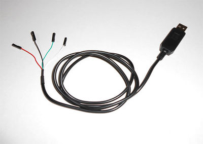
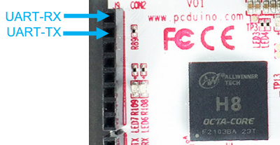
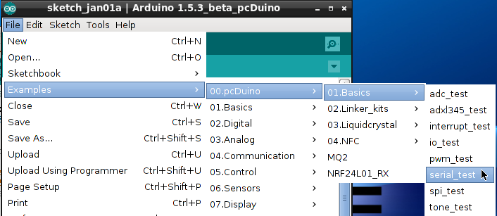
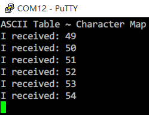

# How to use UART on pcDuino8 Uno
There are many serial devices, like Camera, LCD, WiFi module or Bluetooth, using UART communication protocols.
It is easy to let pcDuin8 Uno talk with other serial device and this tutorial will tell you how to communicate with serial devices via UART on pcDuino8 Uno.

To make it simple, I take a USB serial cable as an example.  

## Prerequisites
**Hardware**
- pcDuino8 Uno
- USB Serial cable

## Steps
### 1. Connect

Make sure you understand the functions of each pin. As to this USB Serial cable, functions are described as follows.
<table>
   <tr>
      <td>color</td>
      <td> description</td>
   </tr>
   <tr>
      <td>red</td>
      <td>        VCC</td>
   </tr>
   <tr>
      <td>black</td>
      <td>GND</td>
   </tr>
   <tr>
      <td>green</td>
      <td>TXD</td>
   </tr>
   <tr>
      <td>white</td>
      <td>RXD</td>
   </tr>
</table>

Connect PC and pcDuino8 uno with USB Serial cable.

* **White line** <---> UART-RXD
* **Green line** <---> UART-TXD

### 2. Install driver(On Windows PC)

Download the [driver](http://www.prolific.com.tw/UserFiles/files/PL2303_Prolific_DriverInstaller_v1_10_0_20140925.zip) and install it.

Plug the USB Serial cable into PC and open **Device manager** to check which COM port number has been recognized by system.

Open **[putty](http://www.putty.nl/)** or other serial software, set the COM number as 12(depend on your system) and the baudrate is 115200. Then click **Open** button.

### 3. Run (On pcDuino8 Uno)
Open Arduino IDE and select serial_test project. Then click  to compile and execute the program.

This project is used to read UART data from PC, then print ASCII number out. If you enter an ASCII character on serial terminal, you will get a corresponding ASCII number back.

### 4. Test (On Windows PC)

Enter characters using keyboard on putty window, you will get the ASCII number seemly like: "I received: 49 ".

