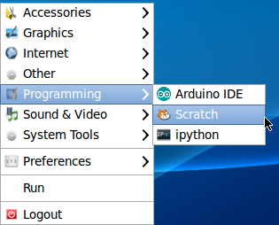
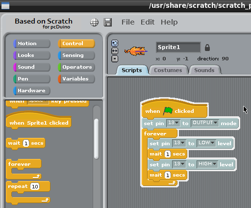

# Scratch Quick Start on pcDuino8 Uno 

Scratch is a free  graphic programming language and you can create your own interactive stories, games, and animations.

This tutorial will tell you how to use Scratch to program GPIOs on pcDuino8 Uno. The first project is always blinking LED.

## Prerequisites
**Hardware**
- pcDuino8 Uno

## Steps
### 1. Open Scratch
Click start menu and select **Programming --> Scratch**.

### 2. Design the Scripts
The program in Scratch is called script, we use it to tell pcDuino how to control the GPIO.

From the window top left, there are different types of control block, especially the **Hardware** which collects the control block of hardware related things, like setting GPIO as input or output, setting the given pin as high level, and so on. As to **Control**, it has logic control, like start, if/else, wait and so on.

Now let's start to blink the LED.

Based on the given script showed in the picture above, take the following steps to edit this script:
* Select the **Control** and drag a **When Green Flag clicked** block into the Scripts area.
* Select the **Hardware**, drag out a **set pin ? to INPUT mode** block, and Snap it onto **When Green Flag clicked**
* Set the pin **13** to **OUTPUT** mode.
* Using the same way to build other blocks.
* With all work done, click the **green flag** or just click the this script to run, please check the LED1's status, is it blinking?

The Scratch programming is easy, isn't it?

Enjoy it!
