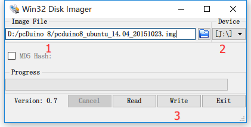

# 如何给pcDuino8 Uno制作可启动的SD卡

pcDuino8 Uno 板上未带有Flash，系统要从SD卡启动。下面将介绍如何给pcDuino8 Uno制作可启动的SD卡。

### 1. 准备

* 8G或以上的TF卡（ 速度等级最好是6或者以上的 )
* TF卡读卡器
* 下载预安装OpenCV的pcDuino8 Uno系统镜像 : [Ubuntu14.04](http://yun.baidu.com/s/1nt1YGBZ#path=%252FpcDuino)
* 制作工具（Windows）：[ Win32DiskImager](http://yun.baidu.com/s/1nt1YGBZ#path=%252FpcDuino%252Ftools)

### 2. 制作

SD卡插入取卡器，接上电脑，如果是Windows 7 或以上，以管理员的身份打开Win32DiskImager。

1. 在 **Image File**选择下载解压后的系统镜像文件
2. 在**Device** 中选择PC识别SD卡后弹出的磁盘
3. 点击 **Write**
4. 等待写入完成，最终会提示**“Write Successful”**。

**注意：文件路径不能出现中文字符，否则会写入失败！**

### 3. 开机运行

根据下图连接外设。如果你手头上没有HDMI显示器、没有键盘和鼠标、也没有网线。请参考[下一节内容](post/2-2-vncviewer-via-usb-otg.md)。

<img src="../images/pcduino8-connection.png" title="connection" width="400")

1. 将SD卡插入 pcDuino8 Uno
2. 通过Micro USB口接5V 2A的直流电源
3. USB 口接一个USB hub，在扩展接入键盘和鼠标
4. 通过HDMI端口连接显示器（可能需要HDMI线缆，或HDMI转接线）
5. 启动后，屏幕会显示桌面系统

**注意：系统第一次启动会进行初始化配置，可能需要花费2-3分钟的时间，USB口还不能使用。在重启系统前，不要尝试关机。**

