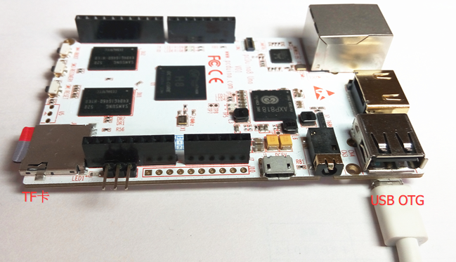
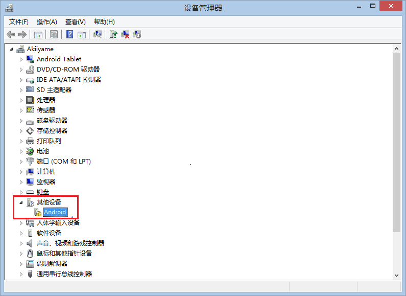
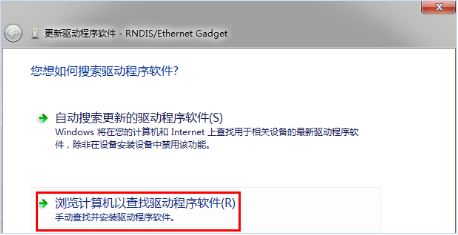
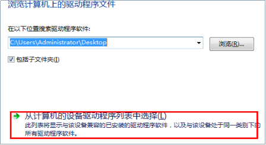
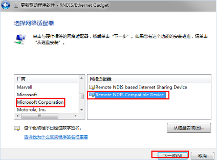
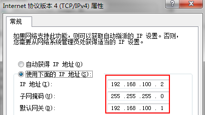
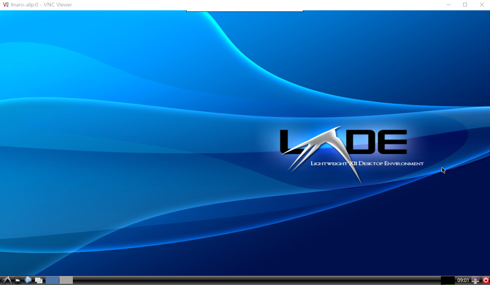

# 如何使用USB数据线远程桌面登录pcDuino8 Uno

很多人一拿到pcDuino8 Uno，可能因为没有鼠标、键盘，也没有HDMI显示器或者网线，一时不知道该如何使用。但大多数人都有手机充电器和普通的USB micro接口的数据线。接下来将介绍用一根USB数据线去访问pcDuino8 Uno，就是说，PC将pcDuino8 Uno识别成了一个网卡，用vncviwer工具可以桌面访问pcDuino8 Uno了。这样就大大简化了整个系统的连接。

## 硬件
- pcDuino8 Uno
- USB micro USB数据线（即普通的Android手机数据线）
- 一台PC（系统要求XP/Win7/Win8）

注：**PC要求安装Windows XP/Win7/Win8，原因在于目前只有这几个版本的系统支持OTG Ethernet驱动。**

## 软件
- [vnc vierwer][1]

## 步骤

### 1. 连接PC与pcDuino8 Uno
刷入系统镜像的TF卡插入pcDuino8 Uno中，找到 USB OTG接口，用USB数据线，一端接OTG，另一端接PC机。

注意：仅用一个USB数据线，既能实现供电，又能实现网络通信，但是PC通过USB输出的电流是有限的，如果pcDuino8 Uno带了过多的负载，会导致硬件供电不足，出现一些无法预料的问题。这时一定要从 USB供电口外接5V直流电源。

### 2. 启动pcDuino8 Uno，配置PC端的驱动（Win7为例）
打开Win7的**设备管理器**，你会发现，启动后连入PC的pcDuino8 Uno被系统识别成了一个Android的设备，标有惊叹号，说明驱动有问题。下面手动更新设备驱动。

- 右键选中该Android设备，点击**更新驱动程序软件**
- 选择**浏览计算机以查找驱动程序软件**

- 选择**从计算机的设备驱动程序列表中选择**

- 硬件分类选择**网络适配器**设备
- 厂商选择：**Microsoft Corporation**，网络适配器选择：**Remote NDIS Compatible Device**

- 忽略系统可能会提示的数字签名问题，继续安装
- 进入**网络连接**，应该可以看到多了一个网卡

### 3. 设置网卡静态IP地址
右键选中新出现的网卡设备，选择**属性**。设置TCP/IPv4静态IP地址：

注意：pcDuino8 Uno中将IP地址设置成了192.168.100.1，需要将PC设置为同一个网段才可以访问。

### 4. 打开vncviewer访问pcDuino8 Uno
- 打开vncviewer，输入IP地址：**192.168.100.1**。

- 输入登录密码：**ubuntu**
- 进入LXDE桌面系统

这样就实现了桌面访问pcDuino8 Uno，仅需一个数据线。

[1]:http://yun.baidu.com/s/1nt1YGBZ#path=%252FpcDuino%252Ftools

