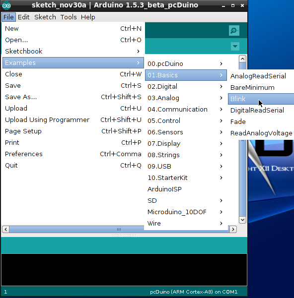

# Arduino编程快速入门
pcDuino8 Uno带有兼容Arduino Uno板的I/O接口，所以很多兼容Arduino的扩展板也可以在pcDuino8 Uno上使用。但注意，pcDuino8 Uno只是部分实现的I/O口的功能，比如接口的ADC功能需要通过外接ADC芯片才能够真正实现。

接下来快速介绍一下在pcDuino8 Uno上如何进行Arduino编程，分别采用两种编程模式！

开源硬件开发中的“点灯“，就跟软件编程中的“Hello World！”程序一样，是每个程序员必经之路，话不多说，直接上步骤。为了简单起见，示例仅演示如何控制GPIO口来控制板上的LED等。


## Arduino IDE模式
### 1. 打开Arduino IDE
点击开始菜单，选择** Programming --> Arduino IDE**。


### 2. 编译运行示例代码
当你打开Arduino IDE后，在board找到一种新的类型：**pcDuino**。


打开一个现有的示例，菜单栏 **File --> Examples --> 01.Basics --> Blink**。



点击按钮编译并执行代码。注意查看LED1是否出现闪烁。

注意：编译生成的二进制可执行文件保存在了**/home/linaro/Arduino**目录下面。可以在命令终端手动执行该可执行文件。

### 3. 查看源码
经过很多层的封装，我们看到的编程接口已经很简单了。
```c
/*
  Blink
  Turns on an LED on for one second, then off for one second, repeatedly.
  This example code is in the public domain.
 */

// Pin 13 has an LED connected on most Arduino boards.
// give it a name:
int led = 13;

// the setup routine runs once when you press reset:
void setup() {
  // initialize the digital pin as an output.
  pinMode(led, OUTPUT);
}

// the loop routine runs over and over again forever:
void loop() {
  digitalWrite(led, HIGH);   // turn the LED on (HIGH is the voltage level)
  delay(1000);               // wait for a second
  digitalWrite(led, LOW);    // turn the LED off by making the voltage LOW
  delay(1000);               // wait for a second
}
```

## 采用命令行模式
除了采用图像编程工具，我们还可以在命令行下进行Arduino的编程。

### 1. 下载命令行下的Arduino开发环境——c_environment

打开命令行终端，运行如下命令：
```bash
$ git clone https://github.com/pcduino/c_environment
```

### 2.  编译
```bash
$ cd c_environment  #进入开发环境
$ vim sample/linker_led_test.c  #查看源代码
$ make  #编译所有示例代码
```

### 3. 运行

所有编译好程序会放在output/test目录下。我们直接适用liner_led_test示例程序控制LED的闪烁。
```bash
$ output/test/linker_led_test 13 #让数字I/O引脚13，每隔1s，交替输出高低电平。
```

用户可以看到在板上LED出现闪烁。使用者还可以参考sample目录下的各种示例，但注意，不是所有的示例都能够在pcDuino8 Uno上运行。

## Arduino程序清单：

```c
/*
* LED test program
*/
#include <core.h>
int led_pin = 1;

void setup()
{
#ifndef PCDUINO_IDE
    if(argc != 2){
        goto _help;
    }
    led_pin = atoi(argv[1]);
#endif
    if((led_pin < 0) || (led_pin > 13)){
        goto _help;
    }
    pinMode(led_pin, OUTPUT);
  return;

_help:
    printf("Usage %s LED_PIN_NUM(0-13)\n", argv[0]);
    exit(-1);
}

void loop()
{
  digitalWrite(led_pin, HIGH);  // 开启LED
  delay(1000);                  // 等待1s
  digitalWrite(led_pin, LOW);   // 关闭LED
  delay(1000);                  // 等待1s
}
```
