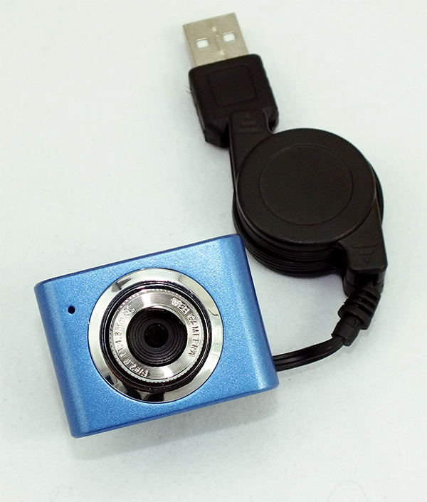
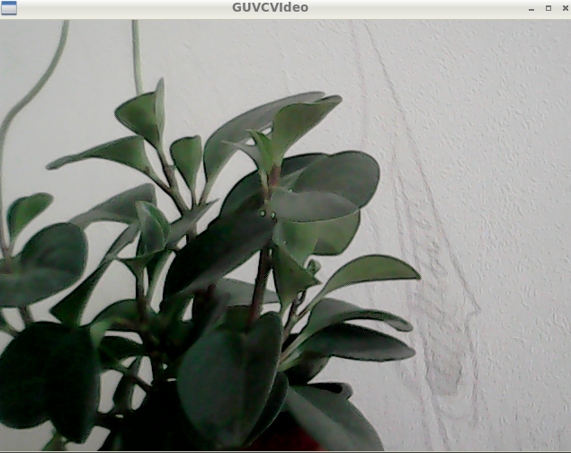

# 如何使用网络摄像头

在OpenCV computer vision kit中自带了一个迷你网络摄像头，插入pcDuino8 Uno即可使用，无需手动安装驱动。在Ubuntu下抓取视频流的工具软件有很多，guvcview、VLC、ffmpeg和OpenCV等。


本教程将介绍如何使用guvcview 播放摄像头的视频流。

## 步骤

### 连接摄像头
将摄像头插入USB Host，并启动pcDuino8 Uno。


打开一个Linux终端，运行如下命令，确定网络摄像头已经被系统识别为：** /dev/video0**。
```bash
$ ls /dev/video0
```

### 打开guvcview
```bash
$ guvcview
```


如果你想着抓取图片或者视频，可以点击界面上的 **Cap. Image** 和 **Cap. Video**。
