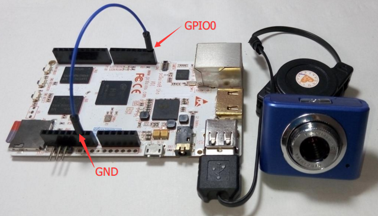

# DIY照相机

正如前面所提到的，我们可以通过guvcview截取摄像头的视频流并保存为一张图片，那么是否有可能做成一个简易的照相机呢？当然可以，而且非常简单！接下来就介绍如何DIY。

## 准备
* 硬件
 - OpenCV computer vision kit

* 软件
 - 预装了OpenCV的Ubuntu 14.04

## 步骤 

### 1. 连接
为了使设计简单，我直接用一根杜邦线将GPIO0和GND端口相连。插入或者拔出来模拟一个按键的按下或者释放。



注意: 你需要了解如下的端口状态。

|连接|状态|逻辑|
|:---:|:---:|:---:|
|拔出杜邦线，GPIO0空载|高电平|1|
|连接GND端口|低电平|0|

### 2. 运行 

```
$ git clone https://github.com/pcduino/pcduino8-uno-guide
$ cd pcduino8-uno-guide/demo/1.CameraDIY/
$ python camera.py
```
注意：如果使用了预案装OpenCV的系统镜像，可以在家目录下看到一个demo文件夹，该目录存放了相应的示例代码。

* 打开的窗口实时显示视频流。
* 把杜邦线从GND端口拔出，再重新插入。
* 照片会保存在当前的目录下。
* 查看图片。
```
$ gpicview
```

### 3. 查看源码

```python

import argparse
import datetime
import time
import cv2
import gpio

btn_pin = "gpio0"
gpio.pinMode(btn_pin, gpio.INPUT)
camera = cv2.VideoCapture(0)
time.sleep(0.25)

while True:
    #read the button status
    current_st = gpio.digitalRead(btn_pin)
    (grabbed, frame) = camera.read()

    if not grabbed:
        break

    cv2.putText(frame, datetime.datetime.now().strftime("%A %d %B %Y %I:%M:%S%p"),
        (10, frame.shape[0] - 10), cv2.FONT_HERSHEY_SIMPLEX, 0.35, (0, 0, 255), 1)

    cv2.imshow("video",frame)
    next_st = gpio.digitalRead(btn_pin)

    #check the button status has been changed
    # if yes, save as a image to local
    if current_st ^ next_st :
        name = datetime.datetime.now().strftime("%Y%m%d%H%M%S")
        cv2.imwrite(name+".jpg", frame, [int(cv2.IMWRITE_JPEG_QUALITY),100])

    key = cv2.waitKey(1)
    if key == ord("q"):
        break

camera.release()
cv2.destroyAllWindows()

```


