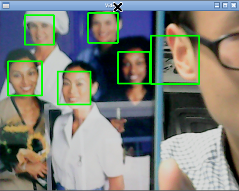

# 使用pcDuino8 Uno Get Started Kit实现人脸识别

## 介绍

OpenCV是用于机器视觉的最流行的函数库，拥有C++, C, Python 和 Java 接口，支持Windows、Linux、Mac OS、iOS 和 Android。

在网上有很多开源的项目采用了OpenCV，并实现了很多有趣的设计。我从一个网上找到了非常简单的人脸识别示例，只用了很少的几行Python代码就实现。具体步骤如下：

## 准备
* 硬件
 - pcDuino8 Uno Get Started Kit

* 软件
 - 预装了OpenCV的Ubuntu 14.04


## 下载源码 
```bash
$ git clone https://github.com/pcduino/pcduino8-uno-guide
$ cd pcduino8-uno-guide/demo/2.FaceDetection/Webcam/
$ python webcam.py haarcascade_frontalface_default.xml
```
注意：**确保摄像头被识别为/dev/video0**。另外，如果使用了预案装OpenCV的系统镜像，可以在家目录下看到一个demo文件夹，该目录存放了相应的示例代码。

我用手机显示了一张照片放到摄像头前，确实能够检测到图片中出现的人脸，但是也出现了识别错误，识别结果如下图所示。



## 理解源代码
我在源码中添加了一些注释，帮助理解。

```python
import cv2
import sys

cascPath = sys.argv[1]
faceCascade = cv2.CascadeClassifier(cascPath)

# set the video source to webcam which is /dev/video0
video_capture = cv2.VideoCapture(0)

while True:
    # Capture frame-by-frame
    ret, frame = video_capture.read()

   # Convert color to gray, because face detection don't need color
    gray = cv2.cvtColor(frame, cv2.COLOR_BGR2GRAY)

    #Do face detection
    faces = faceCascade.detectMultiScale(
        gray,
        scaleFactor=1.1,
        minNeighbors=5,
        minSize=(30, 30),
        flags=cv2.cv.CV_HAAR_SCALE_IMAGE
    )

    # Draw a rectangle around the faces
    for (x, y, w, h) in faces:
        cv2.rectangle(frame, (x, y), (x+w, y+h), (0, 255, 0), 2)

    # Display the resulting frame with rectangle
    cv2.imshow('Video', frame)

    if cv2.waitKey(1) & 0xFF == ord('q'):
        break

# When everything is done, release the capture
video_capture.release()
cv2.destroyAllWindows()
```
如果想了解更多信息，请见点击该[参考链接:Face Detection in Python Using a Webcam](https://realpython.com/blog/python/face-detection-in-python-using-a-webcam/)
