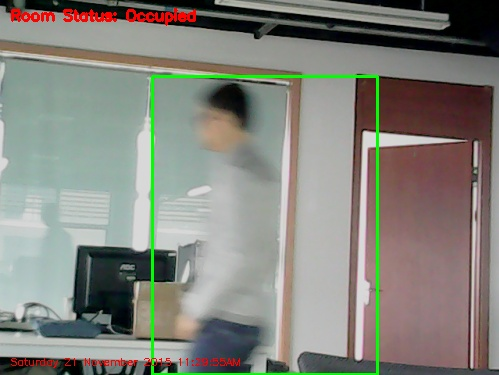

# 如何使用OpenCV实现运动物体检测

## 介绍
[Adrian Rosebrock](http://www.pyimagesearch.com/author/adrian/) 写了一篇博文 , 叫做 " [Home surveillance and motion detection with the Raspberry Pi, Python, OpenCV, and Dropbox](http://www.pyimagesearch.com/2015/06/01/home-surveillance-and-motion-detection-with-the-raspberry-pi-python-and-opencv/)". 非常有趣的一个项目，用树莓派和网络摄像头实现的。只要镜头前有物体运动，就会从当时拍摄的视频中截取一帧，将该移动物体的照片上传到Dropbox中。


整个设计做起来不是很难，我直接将该设计移植到了pcDuino8 Uno。

## 准备:
 **硬件**
- pcDuino8 Uno Get Started Kit


**软件**
- 预安装了OpenCV的Ubuntu 14.04

## 步骤
### 1. 下载源代码
基于 Adrian Rosebrock 所分享的源代码，我删除了将图片上传到Dropbox的功能，而是直接将当时拍下来的照片保存到了本地，你可以从本人的Github仓库中找到分享的代码。
```bash
$ git clone https://github.com/pcduino/pcduino8-uno-guide
$ cd pcduino8-uno-guide/demo/3.MotionDetection
```
注意：如果使用了预案装OpenCV的系统镜像，可以在家目录下看到一个demo文件夹，该目录存放了相应的示例代码。

### 2. 连接USB摄像头
将摄像头插入pcDuino8 Uno，上电启动。进入系统后，打开Linux终端：
```bash
$ ls /dev/video0
```
确保系统识别到了摄像头。

### 3. 测试
```bash
$ python motion-detector.py -c conf.json
```



如果使用了不同型号的网络摄像头，或者修改保存一张图片的间隔时间，等等，你需要根据实际情况修改**conf.json**中的参数。
